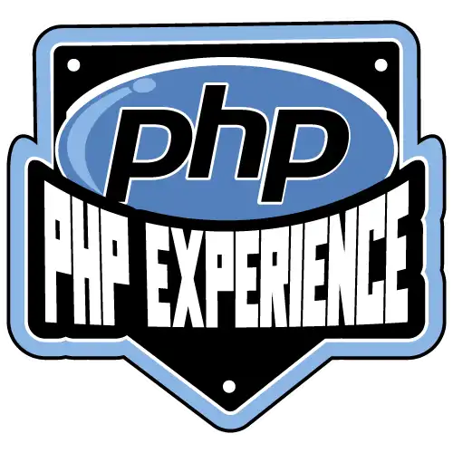
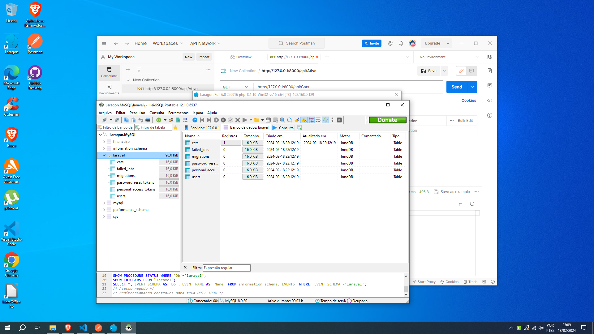
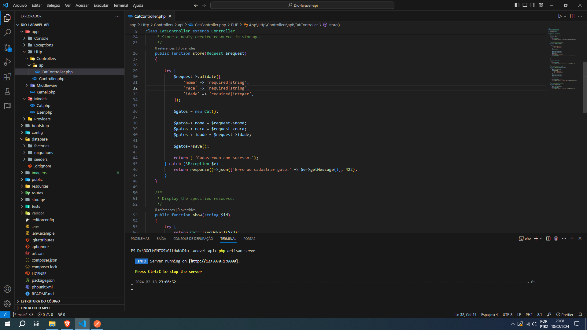
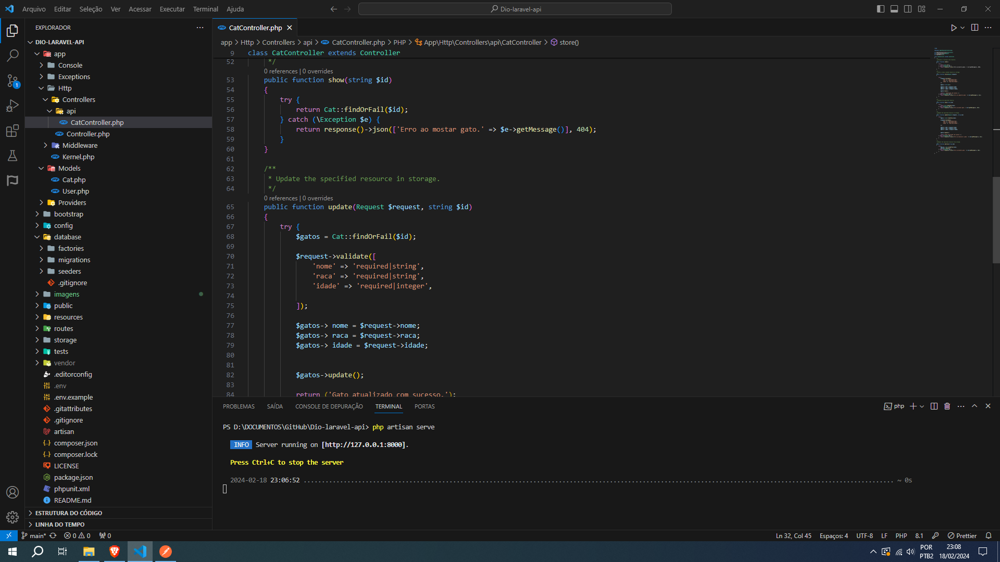
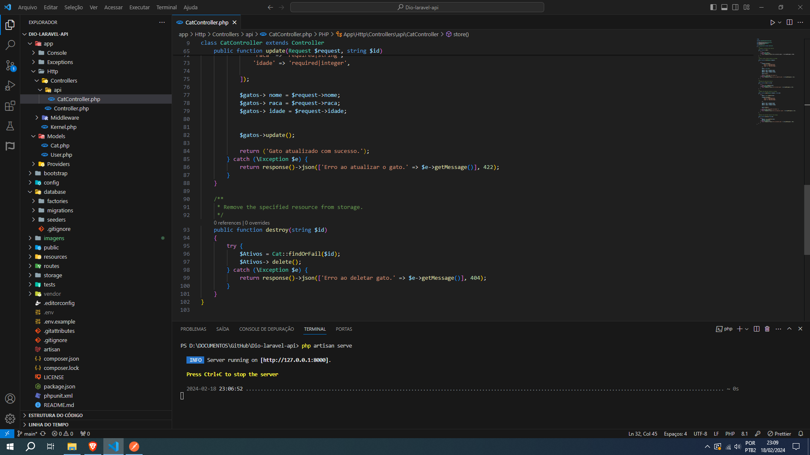
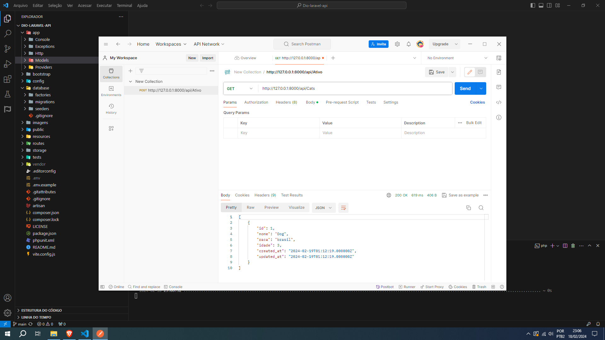

## Formação PHP Experience

Este projeto é uma api rest em php do bootcamp Formação PHP Experience da DIO.

### Recursos Principais

- Framework Laravel
- PHP
- BLADE
- Laragon
- Api rest
- Code Sniffer
- Postman

Utilizei laragon como ambiente de desenvolvimento web.

### Instalação

1. Clone o repositório
2. Execute `composer install`
3. Crie um arquivo `.env`
3. Copie o arquivo `.env.example` para `.env` e ajuste as configurações, como a conexão com o banco de dados.
4. Execute o Laragon para iniciar o banco de dados.
5. Execute `php artisan migrate --seed` para criar as tabelas no banco de dados com as migrações e sementes, se aplicável.

### Uso

- Execute `php artisan serve` para iniciar o servidor local
- Faça a conexão com a api pelo postman e teste a api rest.

## Contribuição

Sinta-se à vontade para contribuir com melhorias ou relatar problemas.

## Licença

O framework Laravel é um software de código aberto licenciado sob a [licença MIT](https://opensource.org/licenses/MIT).
